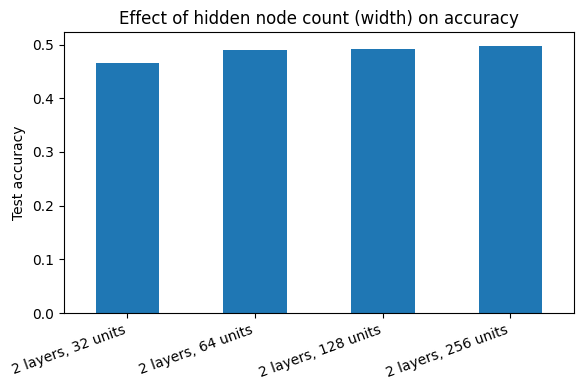
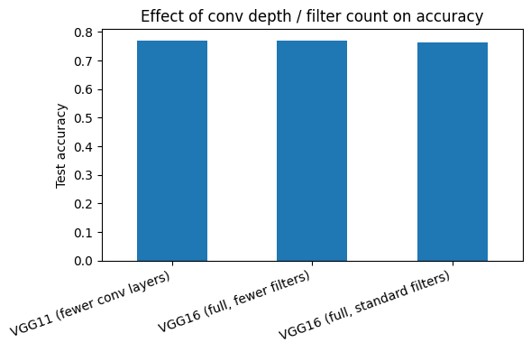
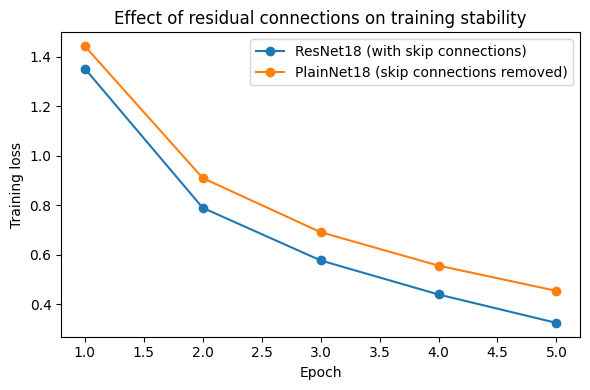

# CNN Architectures from Scratch: MLP vs VGG16 vs ResNet18

 

PyTorch implementations of a feed-forward network, VGG16 and ResNet18 trained from scratch on MNIST, CIFAR-10 and CIFAR-100, with ablation studies and a written theoretical comparison.

## Test accuracy (single run per configuration)

| Model | MNIST | CIFAR-10 | CIFAR-100 |
|---|---|---|---|
| Feed-forward NN | 97.31% | 53.57% | 21.85% |
| VGG16 | 99.49% | **84.19%** | 36.06% |
| ResNet18 | **99.55%** | 82.96% | **53.62%** |

ResNet18's advantage grows with task difficulty (CIFAR-100). Under this short training budget, VGG16 is marginally ahead on CIFAR-10.

## Ablations (CIFAR-10)

| Notebook | Question | Figure |
|---|---|---|
| `01_feedforward_nn` | Does hidden width help? (32→256 units: 46.6%→49.8%) |  |
| `02_vgg16` | Does conv depth / filter count matter? (VGG11 77.1%, VGG16 77.0% / 76.3%) |  |
| `03_resnet18` | Do skip connections stabilise training? |  |

`04_comparative_analysis` adds a formal discussion: vanishing gradients in plain deep nets, why residual connections help, the parameter efficiency of stacked 3×3 convolutions, and the expressive power of the MLP baseline.

## Run it

```bash
pip install -r requirements.txt
jupyter notebook notebooks/01_feedforward_nn.ipynb
```

Datasets download automatically through `torchvision`. A GPU is recommended (about 5-10 minutes per model on Colab).

## Skills demonstrated

PyTorch model implementation, training/evaluation pipelines, controlled ablations, metrics (accuracy, precision, recall, F1), theoretical analysis.

## Background

Originally built for *Computer Vision and Multimodal Machine Learning* at Adelaide University and cleaned up for portfolio use.

## Author

Akshay Kumar Gandla. Released under the [MIT License](LICENSE).
